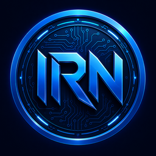

# Ironiun (IRN)

  

  
  
  
  

---

**Ironiun (IRN)** is a fixed-supply ERC-20 token deployed on Polygon POS. It is the native token of the IronMesh ecosystem — a platform for IoT automation, smart infrastructure, and decentralized services.

- **Contract**: `0x1C7B7b638DbA49e96784d1f4dD99A0622Df0EAB7`
- **Network**: Polygon POS (chainId 137)
- **Total Supply**: 100,000,000 IRN
- **Decimals**: 18
- **Mint**: Disabled — supply is fixed forever
- **Verified**: [PolygonScan](https://polygonscan.com/token/0x1C7B7b638DbA49e96784d1f4dD99A0622Df0EAB7)

### Tokenomics

| Allocation | Amount | %  |
|---|---|---|
| Liquidity (QuickSwap) | 1,000,000 IRN | 1% |
| Ecosystem & Development | 49,000,000 IRN | 49% |
| Community & Rewards | 30,000,000 IRN | 30% |
| Reserve | 20,000,000 IRN | 20% |

### Add IRN to MetaMask

1. Open MetaMask → Import Token
2. Paste contract: `0x1C7B7b638DbA49e96784d1f4dD99A0622Df0EAB7`
3. Network: Polygon

Or visit [ironiun.ironmesh.com.ar](https://ironiun.ironmesh.com.ar) and click **"Add to MetaMask"**.

### Buy IRN

[QuickSwap — IRN/POL pool](https://dapp.quickswap.exchange/swap?outputCurrency=0x1C7B7b638DbA49e96784d1f4dD99A0622Df0EAB7)

### Links

- Website: https://ironiun.ironmesh.com.ar
- PolygonScan: https://polygonscan.com/token/0x1C7B7b638DbA49e96784d1f4dD99A0622Df0EAB7
- IronMarket: https://ironmarket.ironmesh.com.ar

---

## Español

**Ironiun (IRN)** es un token ERC-20 de suministro fijo desplegado en Polygon POS. Es el token nativo del ecosistema IronMesh — una plataforma de automatización IoT, infraestructura inteligente y servicios descentralizados.

- **Contrato**: `0x1C7B7b638DbA49e96784d1f4dD99A0622Df0EAB7`
- **Red**: Polygon POS (chainId 137)
- **Suministro total**: 100,000,000 IRN
- **Mint**: Deshabilitado — el suministro es fijo para siempre
- **Verificado**: [PolygonScan](https://polygonscan.com/token/0x1C7B7b638DbA49e96784d1f4dD99A0622Df0EAB7)

### Agregar IRN a MetaMask

1. Abrí MetaMask → Importar Token
2. Pegá el contrato: `0x1C7B7b638DbA49e96784d1f4dD99A0622Df0EAB7`
3. Red: Polygon

O visitá [ironiun.ironmesh.com.ar](https://ironiun.ironmesh.com.ar) y hacé click en **"Agregar a MetaMask"**.

### Comprar IRN

[QuickSwap — pool IRN/POL](https://dapp.quickswap.exchange/swap?outputCurrency=0x1C7B7b638DbA49e96784d1f4dD99A0622Df0EAB7)

---

## 中文

**Ironiun (IRN)** 是部署在 Polygon POS 上的固定供应量 ERC-20 代币，是 IronMesh 生态系统的原生代币 —— 一个专注于物联网自动化、智能基础设施和去中心化服务的平台。

- **合约地址**: `0x1C7B7b638DbA49e96784d1f4dD99A0622Df0EAB7`
- **网络**: Polygon POS（链 ID 137）
- **总供应量**: 100,000,000 IRN
- **铸造**: 已禁用 — 供应量永久固定
- **已验证**: [PolygonScan](https://polygonscan.com/token/0x1C7B7b638DbA49e96784d1f4dD99A0622Df0EAB7)

### 将 IRN 添加到 MetaMask

1. 打开 MetaMask → 导入代币
2. 粘贴合约地址：`0x1C7B7b638DbA49e96784d1f4dD99A0622Df0EAB7`
3. 网络选择：Polygon

或访问 [ironiun.ironmesh.com.ar](https://ironiun.ironmesh.com.ar) 点击 **"添加到 MetaMask"**。

### 购买 IRN

[QuickSwap — IRN/POL 流动性池](https://dapp.quickswap.exchange/swap?outputCurrency=0x1C7B7b638DbA49e96784d1f4dD99A0622Df0EAB7)
